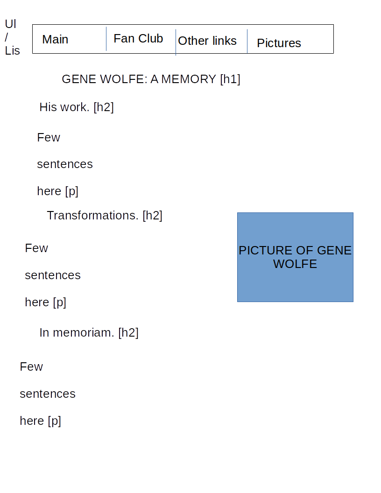
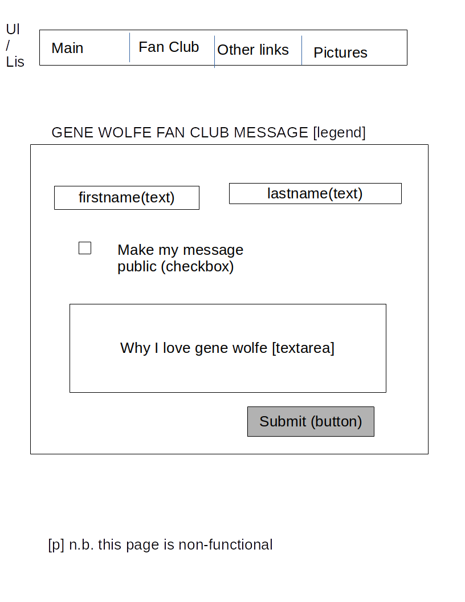
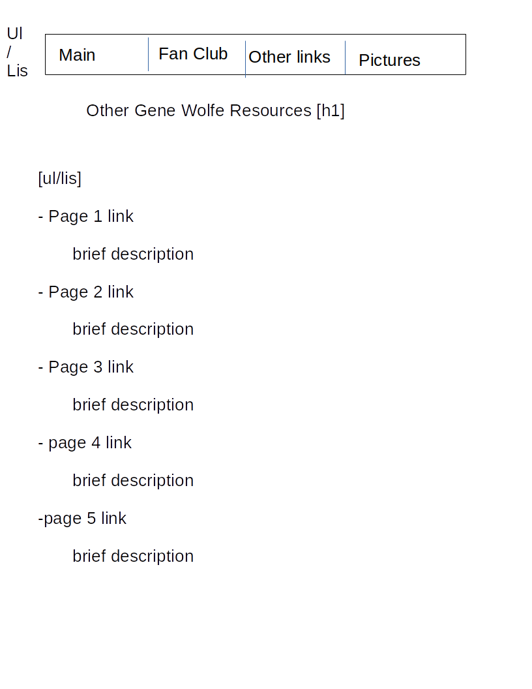
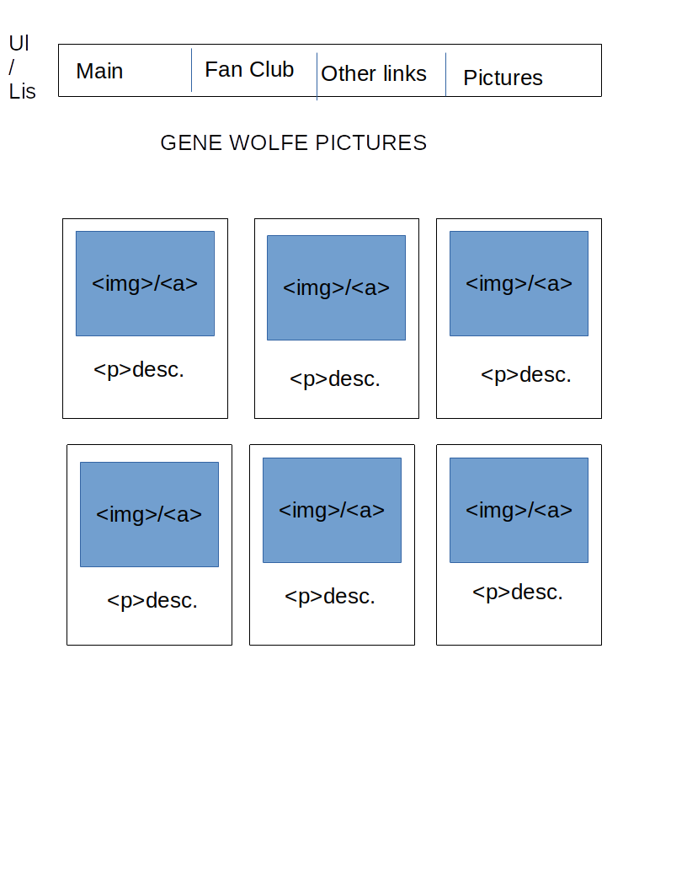

Four pages:

1. Brief bio/description

2. Join the fan club! (Note: doesn’t work)

3. Links to other Gene Wolfe pages, Gene Wolfe books, etc.

4. Pictures of Gene Wolfe, friends, and/or books.

General styling:

Headers:
 - Font:  Garamound
 - Size (h1): 32px
 - size (h2): 24px
 - Color: black
 
Other text:
 - Font: Garamound
 - Size: 18px
 - Color: black
 
Main page background color: paper color (Beige?)

Nav bar:
 - Background color: black
 - Text Color: muted yellow
 - Background color (selected/hover): muted yellow
 - Text color (selected/hover): black
 
Form:
 - Text color: black
 - Background color: light-grey
 - Button - styling: Rounded corners, grey, ornate?
 
Links styling:
 - No underline
 - Text color/hover text color (red/green)
 
Pictures styling:
 - Box background color: light-blue
 - Box text color: dark-green
